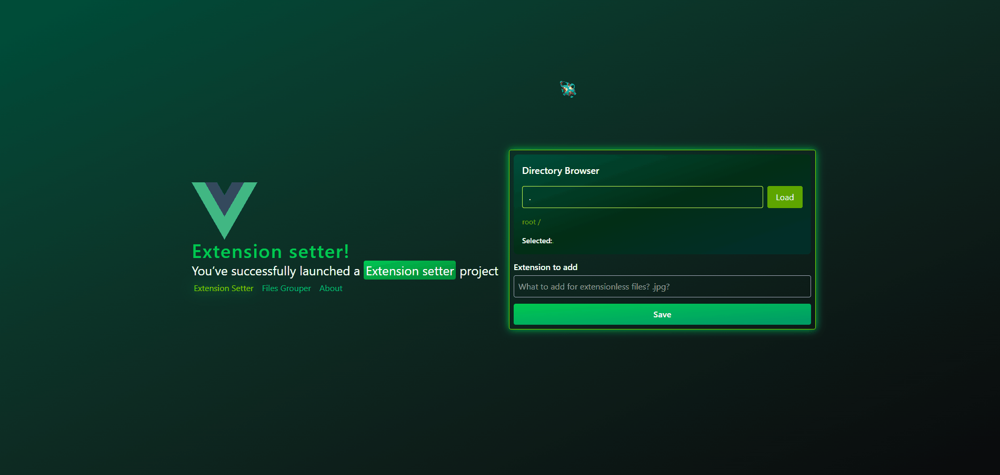

<h1 align="center">
    Extension Setter
</h1>
<br/>
<div align="center">
   
  
</div>

<div align="center">
  
</div>

## Welcome!

- [View frontend side of the project online](https://gymmed.github.io/Extension-Setter)

### Description

A web application that allows users to browse a server-provided directory, add missing file extensions, and group files by their extensions.

**Tech stack:**

- **Backend:** [Express.js](https://github.com/expressjs/express)
- **Frontend:** [Vue.js](https://github.com/vuejs/core), [Tailwind CSS](https://tailwindcss.com/)

### Prerequisites

- Node.js
- NPM or Yarn installed

# 1. How to launch this project

**[✔] 1.1 Start from frontend**

- Run inside the root of the project:

```bash
cd frontend
```

to access frontend part

**[✔] 1.2 Install dependencies**

- To install the required packages run:

```bash
npm install
```

**[✔] 1.3 Launch the project**

- To build project use:

```bash
npm run build
```

**[✔] 2.1 Start from backend**

- Run inside the root of the project:

```bash
cd backend
```

if you are inside frontend run:

```bash
cd ../backend
```

to access backend part

**[✔] 2.2 Install dependencies**

- To install the required packages run:

```bash
npm install
```

**[✔] 2.3 Build project**

- To build project use:

```bash
npm run build
```

**[✔] 2.4 Launch the project**

- To start project run:

```bash
nodemon server.js
```

if you don't have nodemon use `node .`, `node server.js`.
